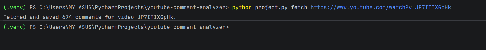
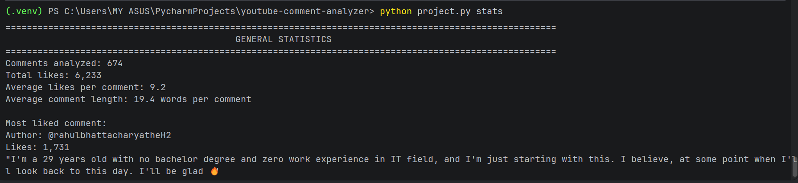

# YouTube Comment Analyzer

A command-line data analysis tool that converts YouTube comments into a searchable SQLite dataset.

## Demo

### Fetching Comments


### Analyzing Comments


### Generating Statistics


---

## Tech Stack

- Python 3
- SQLite
- YouTube Data API v3
- argparse
- pytest
- Google API Client
- python-dotenv

---

## What this is

YouTube Comment Analyzer is a command-line application that transforms a YouTube video's comment section into a searchable dataset. It fetches all available top-level comments from a public YouTube video, stores the data in a local SQLite database, and allows users to search, rank, and summarize comments without repeatedly querying the YouTube Data API.

Once comments have been fetched, every subsequent command operates entirely on the local database. This makes the application significantly faster, reduces API usage, and allows users to explore the data even without an internet connection.

The application provides five core features:

- **Search** every comment for a keyword.
- **Display** the most-liked comments.
- **Identify** the most frequently used meaningful words after filtering common stop words and YouTube-specific filler words.
- **Generate** summary statistics, including total comments, total likes, average likes, average comment length, and the most-liked comment.
- **Store** comments by video ID so multiple videos can be analyzed independently.

---

## Why I built it

Although YouTube contains enormous amounts of user-generated discussion, its interface provides very few tools for analyzing those conversations. Users can sort comments by Top or Newest, but they cannot search for keywords, identify recurring topics, or generate summary statistics across thousands of comments.

I wanted to build a tool that treated a video's comment section as structured data rather than something that could only be read manually. This project reflects my interest in building tools that turn large amounts of unstructured information into useful insights. At the same time, this project served as an opportunity to bring together many of the concepts covered in CS50P, including API integration, command-line interfaces, exception handling, testing, and algorithmic optimization, in a single application.

---

## How it works

The application uses the YouTube Data API v3 to retrieve all available top-level comments associated with a video. Since the API returns comments in multiple pages, the program automatically follows each pagination token until all available comments have been collected.

Each comment's text, author, like count, and associated video ID are then stored in an SQLite database. After this initial fetch, every command reads directly from the local database instead of making additional API requests. This eliminates unnecessary network calls during analysis, conserves API quota, and makes repeated analyses of fetched videos nearly instantaneous.

To simplify the user experience, the application automatically identifies the most recently fetched video by tracking the latest stored comments in SQLite. Commands such as `search`, `top`, `freq`, and `stats` therefore operate on the current dataset without requiring the user to repeatedly specify a video URL.

---

## Commands

| Command | Description |
|---|---|
| `fetch <url>` | Retrieve and store comments from a YouTube video |
| `search <keyword>` | Find comments containing a keyword |
| `top <n>` | Display the most-liked comments |
| `freq <n>` | Display the most frequent meaningful words |
| `stats` | Display summary statistics |

---

## Example output

The following examples were generated by analyzing the comments from the very first CS50P lecture I watched, **CS50P - Lecture 0: Functions, Variables**.

```
$ python project.py fetch https://www.youtube.com/watch?v=JP7ITIXGpHk
Fetched and saved 674 comments for video JP7ITIXGpHk.
```

```
$ python project.py top 5
====================================================================
                      COMMENTS RESULTS (5 FOUND)
====================================================================
1. @rahulbhattacharyatheH2 (1731 likes)
"I'm a 29 years old with no bachelor degree and zero work experience in
IT field, and I'm just starting with this. I believe, at some point when
I'll look back to this day. I'll be glad 🔥"

2. @CrimsonCypher (1167 likes)
"I think the craziest thing about me watching this video is that I'm
currently in college, paying to take this course, and the free online
course is teaching me better."

3. @marthalaguilera (970 likes)
"I truly appreciate the kindness of putting CS50 out here for free!
Thank you, thank you!"

4. @GlenMillard (291 likes)
"I'm 57. So, I'm a little older than most of the folks that you teach!
When I was in high school, 9th grade around late 1980, I had a teacher
who was just the best. He made classes interesting. Think 'Dead Poets
Society'. You, my friend, are just like an updated New Millennium
version of him. Thanks for these lectures. Much appreciated! 🤩"

5. @Walkwithme-w2x (195 likes)
""Hello world" I am 60. Excited to learn to code with Python starting
CS50 today. It's never too late!"
====================================================================
```

```
$ python project.py freq 10
====================================================================
                    WORD FREQUENCY (TOP 10 FOUND)
====================================================================
1. code                  101
2. python                 79
3. course                 67
4. david                  60
5. terminal               59
6. name                   50
7. learning               48
8. get                    41
9. starting               38
10. one                   38
====================================================================
```

```
$ python project.py stats
====================================================================
                        GENERAL STATISTICS
====================================================================
Comments analyzed: 674
Total likes: 6,233
Average likes per comment: 9.2
Average comment length: 19.4 words per comment

Most liked comment:
Author: @rahulbhattacharyatheH2
Likes: 1,731
"I'm a 29 years old with no bachelor degree and zero work experience in
IT field, and I'm just starting with this. I believe, at some point when
I'll look back to this day. I'll be glad 🔥"
====================================================================
```

---

## Project structure

```
youtube-comment-analyzer/
│
├── assets/
│   ├── fetch.png
│   ├── analysis.png
│   └── stats.png
│
├── project.py
├── constants.py
├── test_project.py
├── requirements.txt
├── README.md
└── .gitignore
```

---

## Database design

The application stores comments in SQLite using the following schema:

| Column | Type | Description |
|---|---|---|
| `comment` | TEXT | Comment content |
| `likes` | INTEGER | Number of likes received |
| `author` | TEXT | YouTube username |
| `video_id` | TEXT | Associated YouTube video |

Each comment is associated with a video ID, allowing multiple videos to be analyzed independently.

### `project.py`

This file contains the main application logic.

The `main()` function parses command-line arguments using `argparse` and routes execution to one of five subcommands: `fetch`, `search`, `top`, `freq`, or `stats`.

The helper functions each have a single responsibility:

- `extract_video_id()` extracts the video ID from either a standard YouTube URL or a shortened `youtu.be` link.
- `fetch_comments()` communicates with the YouTube Data API, retrieves every page of the top-level comments, and converts API errors into user-friendly exceptions.
- `save_comments()` stores comments in SQLite while replacing older data for the same video.
- `search_comments()`, `top_comments()`, `word_frequency()`, and `compute_stats()` perform data analysis without producing any console output.
- `display_*()` functions are responsible solely for formatting and displaying results.
- `get_last_video_id()` identifies the most recently fetched video so users do not need to repeatedly specify which dataset to analyze.

Separating analysis from presentation made the program significantly easier to test and maintain.

### `constants.py`

This file contains three lookup collections used during word-frequency analysis:

- `STOP_WORDS`
- `YOUTUBE_NOISE_WORDS`
- `CONTRACTIONS`

Keeping these collections separate from the application logic makes the filtering rules easier to maintain and expand.

### `test_project.py`

Contains unit tests written with `pytest`.

Each test creates its own temporary SQLite database using `tmp_path`, ensuring that tests are completely isolated and never modify the user's real database.

### `requirements.txt`

Lists the external dependencies required to run the application.

---

## Design decisions

A major design goal was keeping the application modular and easy to maintain. I separated data processing from user interface logic by ensuring that functions responsible for database queries and analysis return Python data structures instead of printing directly to the terminal. Display functions handle formatting separately, which keeps the core logic reusable and makes individual functions easier to test.

Each stored comment includes its associated video ID, allowing comments from different videos to be stored and analyzed independently. When a previously fetched video is fetched again, its existing comments are replaced with newly retrieved data to keep the dataset current. Commands such as `search`, `top`, `freq`, and `stats` use this video ID to ensure analysis is performed on the currently selected dataset.

I also prioritized efficiency when processing larger datasets. Instead of sorting every word when finding the most frequent terms, the application uses `heapq.nlargest()` to retrieve only the required number of results. Similarly, while calculating statistics, the program identifies the most-liked comment during the same iteration used to calculate totals and averages, avoiding an additional database query or sorting operation.

Another design decision was making output deterministic. When multiple comments have the same number of likes, the program consistently returns the comment that appeared first in the database. This predictable behavior makes testing easier and prevents confusing changes between identical runs.

Finally, I designed error handling around the user's experience. Instead of exposing raw SQLite or YouTube API exceptions, the program converts common failures into clear messages that explain what went wrong, such as invalid API keys, unavailable videos, disabled comments, or attempts to analyze data before fetching comments.

---

## Testing

The project includes automated tests written with `pytest`.

Beyond verifying expected outputs, I focused on testing situations that could easily introduce subtle bugs:

- Ensuring comments from different videos remain isolated within the database.
- Confirming deterministic behavior when multiple comments share the same number of likes.
- Verifying that re-fetching a previously analyzed video correctly updates the active dataset.
- Testing empty databases and missing data to ensure graceful error handling.
- Validating helper functions independently from the command-line interface.

Using temporary databases allows every test to run independently without affecting any existing data.

---

## Challenges

The most challenging part of the project was designing the workflow around analyzing multiple videos.

My initial approach required every command to receive a video ID or URL. Although this was simple to implement, it created an inconvenient user experience because users had to repeatedly provide the same information after fetching a video. I wanted the application to remember the most recently fetched dataset automatically.

Implementing this behavior became more complex when considering repeated fetches. For example, a user could fetch Video A, fetch Video B, and later fetch Video A again. The program needed to recognize that Video A was now the active dataset rather than relying only on whether a video already existed in the database. I solved this by using the order of fetch operations stored in SQLite to determine the current video. This required additional testing to ensure that repeated fetches always updated the active dataset correctly.

Another challenge was maintaining clean separation between program logic and terminal output. Early versions of the project combined database operations, analysis, and printing inside the same functions. While functional, this made testing more difficult because tests depended on captured terminal output. Refactoring the application into separate analysis and display functions required reorganizing several parts of the code but resulted in a cleaner structure and simpler tests.

Improving performance also required reconsidering some early implementations. The first version of word frequency analysis sorted all words even when only a small number of results were needed. Replacing this with `heapq.nlargest()` reduced unnecessary processing for larger comment collections. Similar improvements were made by tracking the most-liked comment during statistics calculation instead of performing an additional sort.

### Future improvements

If I continue developing this project, I would like to add several features:

- Sentiment analysis to measure the overall tone of comments.
- CSV export for further analysis in spreadsheet software.
- Interactive filtering by comment author.
- Support for comment replies in addition to top-level comments.
- Data visualizations using Matplotlib.
- Comparative analysis between multiple videos.

---

## Setup

### 1. Clone the repository

```bash
git clone https://github.com/YOUR_USERNAME/youtube-comment-analyzer.git
cd youtube-comment-analyzer
```

### 2. Install the dependencies

```bash
pip install -r requirements.txt
```

### 3. Create a YouTube Data API key

This project uses the YouTube Data API v3 to retrieve video comments.

1. Open the [Google Cloud Console](https://console.cloud.google.com/).
2. Create a new project (or select an existing one).
3. Navigate to **APIs & Services → Library**.
4. Enable **YouTube Data API v3**.
5. Go to **APIs & Services → Credentials**.
6. Click **Create Credentials → API key**.
7. Copy the generated API key.

> **Note:** The YouTube Data API provides a free daily quota (10,000 units by default). Fetching comments consumes quota, so repeatedly analyzing very large videos may exhaust your daily limit.

### 4. Configure your environment

Create a `.env` file in the project root containing your API key.

```
YOUTUBE_API_KEY=your_api_key_here
```

### 5. Run the application

```bash
# Fetch comments from a video
python project.py fetch https://www.youtube.com/watch?v=VIDEO_ID

# Search comments
python project.py search keyword

# Display the top comments
python project.py top 10

# Display the most frequent words
python project.py freq 10

# Display summary statistics
python project.py stats
```

### Notes

- The application automatically creates `video_data.db` after the first successful `fetch` command.
- `video_data.db` stores downloaded comments locally and should **not** be committed to Git.
- The `.env` file contains your private API key and should also be excluded from version control.